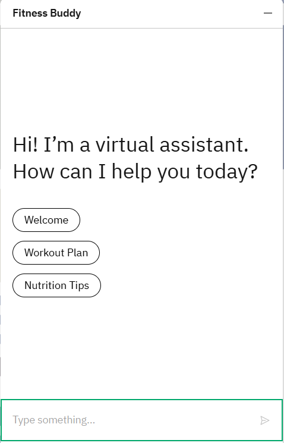
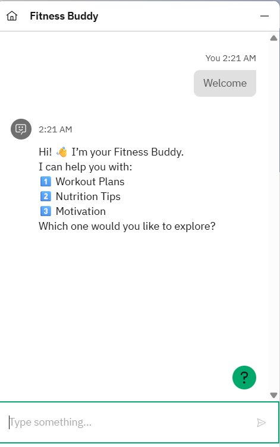
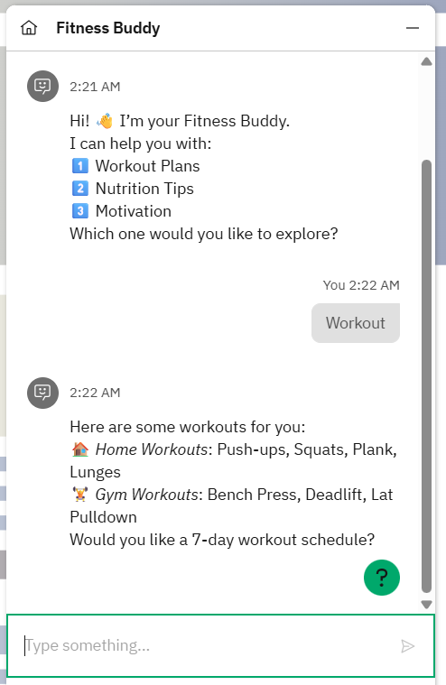
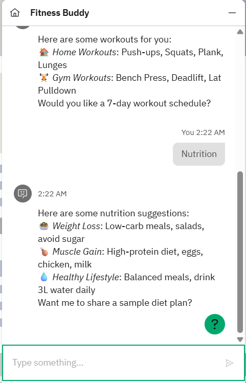
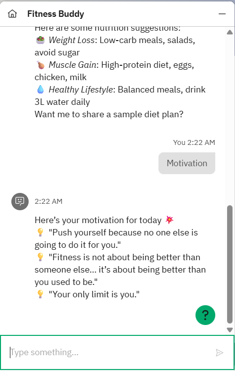

Fitness Buddy – IBM Summer Intership Project by Edunet by Rudraksh Agarwal

Problem Statement
Fitness Buddy is a virtual AI-powered assistant that provides personalized workout plans, nutrition tips, and motivational quotes to help users maintain a healthy lifestyle.

Features
**Workout Plans** – Home and gym workout suggestions
**Nutrition Tips** – Weight loss, muscle gain, and healthy lifestyle diets
**Motivation** – Fitness-related quotes for encouragement

Tools & Services Used
**IBM watsonx Assistant (Lite Plan)**
No external storage or paid services

How to Import the Assistant
1. Download the `fitness_buddy_config.json` from `config/` folder.
2. Open IBM watsonx Assistant.
3. Create a new Assistant.
4. Go to **Actions** → **Import** → Upload `fitness_buddy_config.json`.

How to Test
- Type "Hi" to see the Welcome message.
- Type "workout plan" to see workout suggestions.
- Type "diet tips" to get nutrition guidance.
- Type "motivate me" to see motivational quotes.

Demo
You can interact with the assistant via IBM Web Chat integration (Link available after deployment in your account).
You can use this link to view the assistant
https://shorturl.at/geInl

Screenshots

